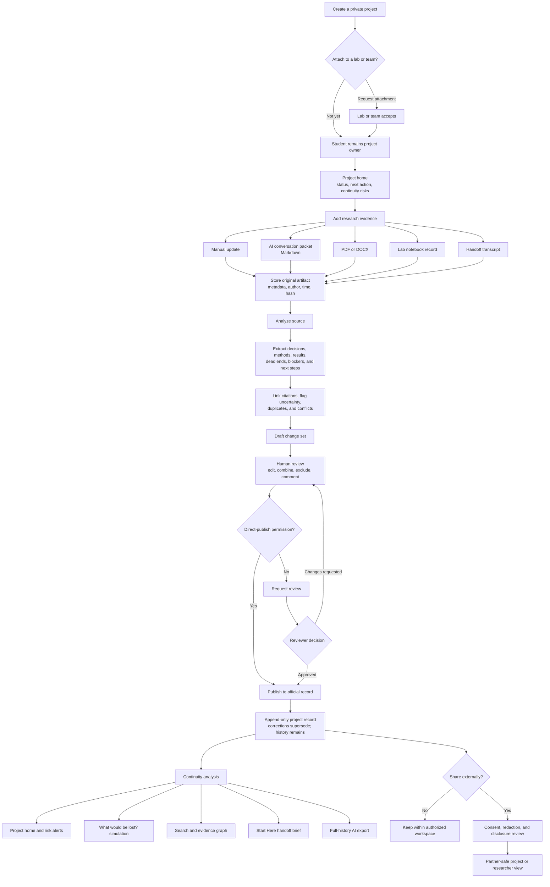

# URI Product Flow

This document records the approved UX direction for turning URI into a user-ready research continuity platform. The interface may change completely; the durable product loop is evidence in, reviewed knowledge out, and safer handoffs over time.

## Product Shell

Use one consistent navigation model instead of manual role lenses:

1. **Home** — assigned work, review requests, continuity risks, and recent activity.
2. **Projects** — project overview, official history, people, artifacts, and settings.
3. **Evidence** — uploads, analysis status, extracted drafts, and source provenance.
4. **Reviews** — grouped change sets, comments, approvals, and audit history.
5. **Handoffs** — readiness checklist, interview questions, Start Here brief, and incoming tasks.
6. **Discover** — shelved projects and approved external sharing.

## Guardrails

- AI output is always a cited draft; it never silently changes the official record.
- Project admins grant publishing and review capabilities and may delegate reviewers.
- Private-to-lab attachment preserves student authorship and prior history.
- Search, exports, and direct URLs enforce the same permissions as visible pages.
- External views receive only explicitly approved, redacted data.

## Presentation Path

For the two-week demo, follow the central path from **Project home** through **Add research evidence**, **Human review**, **Publish**, **Continuity analysis**, and **Start Here**, then finish with the AI export. Use the loss simulation before and after publishing to make the value change visible.
